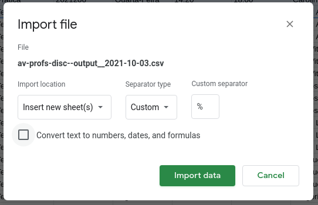

# Avaliação de Disciplinas e Professores

## Contextualização

Esse é um _script_ auxiliar ao projeto da Avaliação de Disciplinas e Professores, da SA-SEL. Ele serve para extrair do JúpiterWeb informações relevantes sobre as disciplinas dos cursos de Engenharia Elétrica da USP - CAASO.

## Como utilizar

Caso possua o arquivo binário pré-compilado, basta executá-lo. Caso contrário, instale as dependência (`pip -r requirements.txt`) e execute o arquivo `main.py` a partir da raiz do projeto (`python src/main.py`).

### Manutenção

Deve-se incluir na raiz do projeto um arquivo `.env` com a chave de uma planilha (Google Sheets) aonde estão listadas as disciplinas. Essa chave deve constar na variável `SPREADSHEET_KEY`. Além disso, também é necessário fornecer um arquivo `credentials.json` com para interação com a API do Google Sheets (em caso de dúvidas, veja [esse vídeo](https://www.youtube.com/watch?v=cnPlKLEGR7E)).

Essa planilha deve estar no formato como nas imagens a seguir.

 
 

## Resultados

O _script_ irá criar um arquiv `.csv` com as colunas `CÓDIGO DA DISCIPLINA`, `NOME DA DISCIPLINA`, `TIPO`, `CLASSE`, `CÓDIGO DA TURMA`, `DIA DA AULA`, `INÍCIO DA AULA`, `TÉRMINO DA AULA`, `DOCENTE`, `INSCRITOS UNIFICADO`, `INSCRITOS ELETRÔNICA` e `INSCRITOS AUTOMA`.

Esse arquivo usa `%` como separador e pode ser importado em uma planilha do Google Sheets como a seguir.

